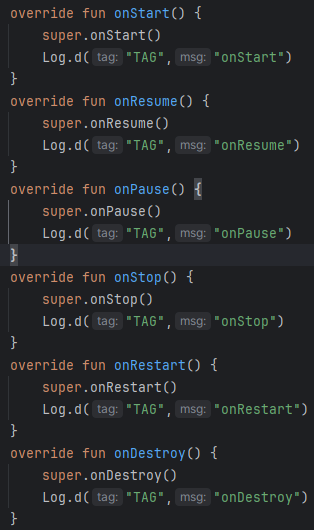
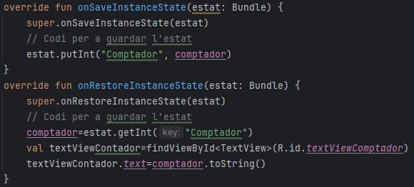
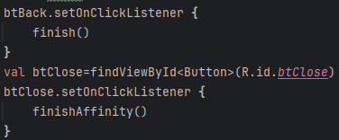
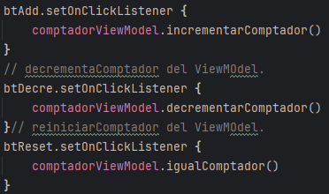
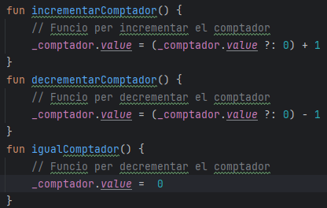
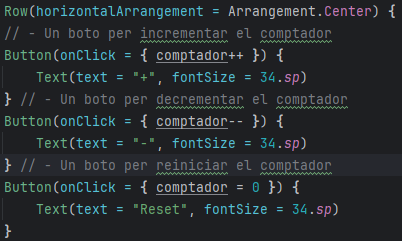

# Anàlisi de tecnologies per a aplicacions en dispositius mòbils
## Introducció
En aquesta tasca anem a fer un repàs pràctic i reflexiu sobre els aspectes més rellevants de la unitat, tals com:

1. Estructura d'un projecte i fitxers principals.
2. Activitats: Què són i com s'organitzen
3. Anàlisi del cicle de vida d'una activitat
4. Manteniment de l'estat mitjançant Bundles
5. Components d'arquitectura d'Android: MVVM
6. Conceptes i forma de treball de Jetpack Compose

## 1. Estructura d'un projecte i fitxers principals.
El primer que hem fet es accedir als recursos del projecte base que ens fa falta per a fer el nostre projecte. Hem entrat al github i hem descarregat el recursos de la unitat en este enllaç [documentació oficial](https://github.com/joamuran/RecursosPMDM).
## 2. Activitats: Què són i com s'organitzen.
En la primera activitat tindrem que ficar un comptador,on una vegada ficats uns boton de reiniciarlo i decrementat el comptador,la rotacio de la pantalla ens borra les dades del comptador actuals per aixo tindrem que fer alguna cosa...i ficarli ciles de vida que no te tots.

En la segona activitat el projecte del comptador amb MVVM, tindrem que afigir les modificacions necessàries per tal que suporte la possiblitat de ressetejar el comptador i decrementar-lo. Per a això tindrem que definir les funcions necessàries al ViewModel i fer ús d'aquestes des de la vista.

En la tercera activitat el projecte ComptadorComposable,modificarem el codi ne cessari per tal d'afegir els botons de decrementar i ressetejar el comptador.
Per a això us serà d'utilitat la funció composable Row, la qual ens permetrà organitzar diversos composables en una fila, de la mateixa manera que Column ho feia en una columna.
## 3. Anàlisi del cicle de vida d'una activitat.
En la classe Activity conté diversos mètodes que s'invoquen, a mode de callback, amb cada canvi d'estat del cicle de vida, i que podrem sobreescriure en totes les classes que deriven d'aquesta.

## 4. Manteniment de l'estat mitjançant Bundles
I els metodes relacionats per a quan rotem la pantalla no es perguen les dades.

També en MostrarComptadorActivity tindrem que afegir un botons per a poder fer enrrere i tornar a l'activitat principal.Tot aço ho farem en el layout del xml.

## 5. Components d'arquitectura d'Android: MVVM
En la segona activitat quan pretem els botons que vullgam tindran ordren de incrementar,decrementar i reiniciar. Una velgada pulsat ells cridaran a una funcio que ens mostrar per text el que hem pulsat i actualitara el comptador.

En el view model tindrem que afegir 2 noves funcions per a decrementar i reniciar el comptador.

També en el xml. tindrem que afegir els nous botons per a poder fer les activat anterior.

## 6. Conceptes i forma de treball de Jetpack Compose
Una vegada creat un projecte la Activitat Principal,en l'arquitectura que se'ns ha creat, veurem que no existeix la carpeta res/layout, i que el codi en l'activitat principal (MainActivity.kt) ara derivarà de ComponentActivity, és a dir, es tracta d'una activitat que contindrà composables.

Una vegada creats el botons que estem duguent a terme en les activitats tindrem que ficarlos horizontalment pero dins de la columna principal.

